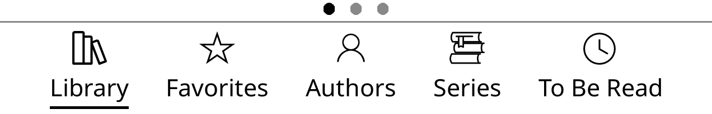
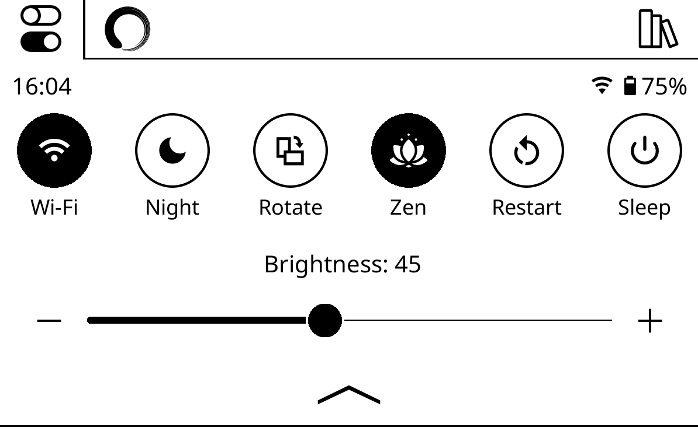
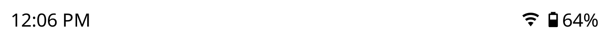
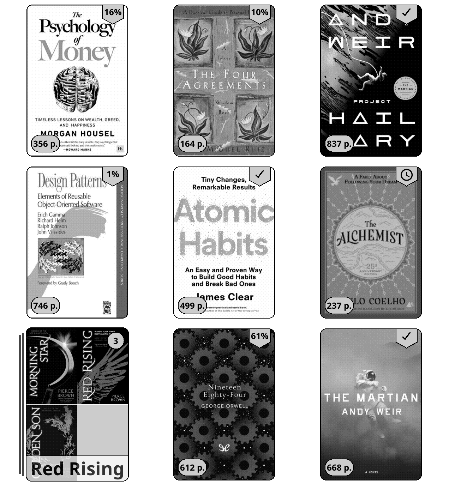
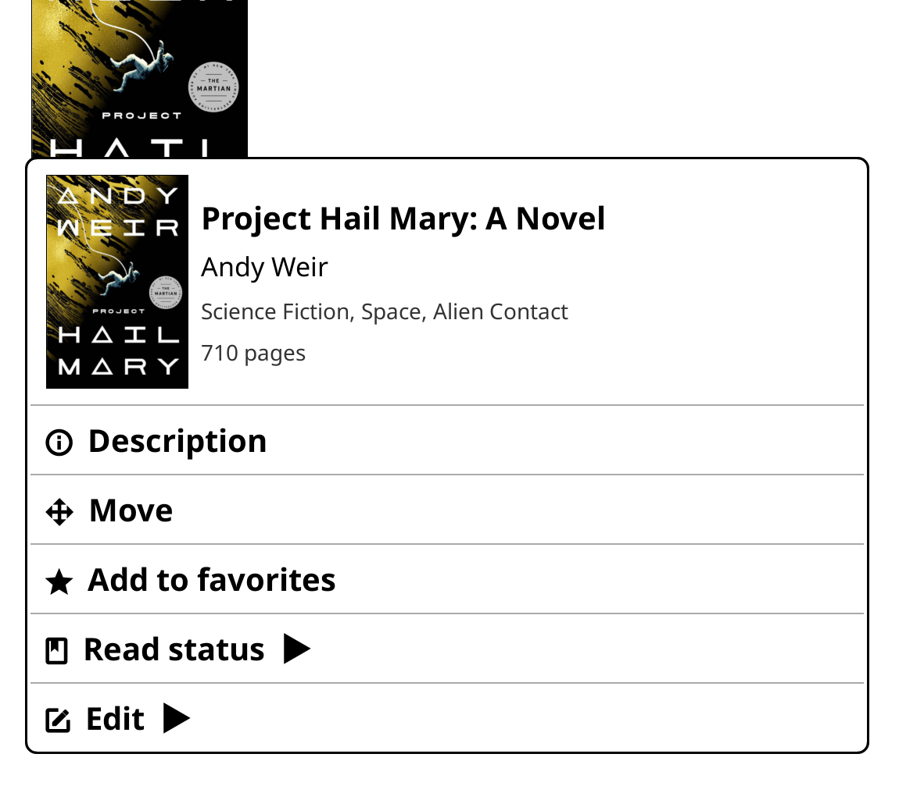
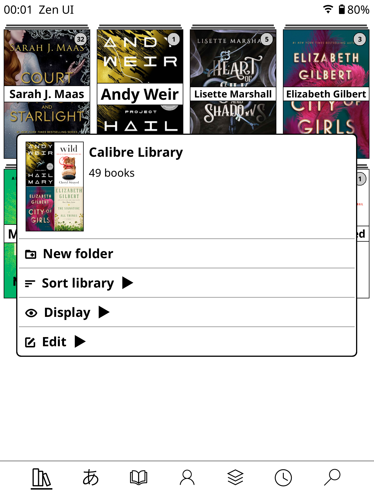
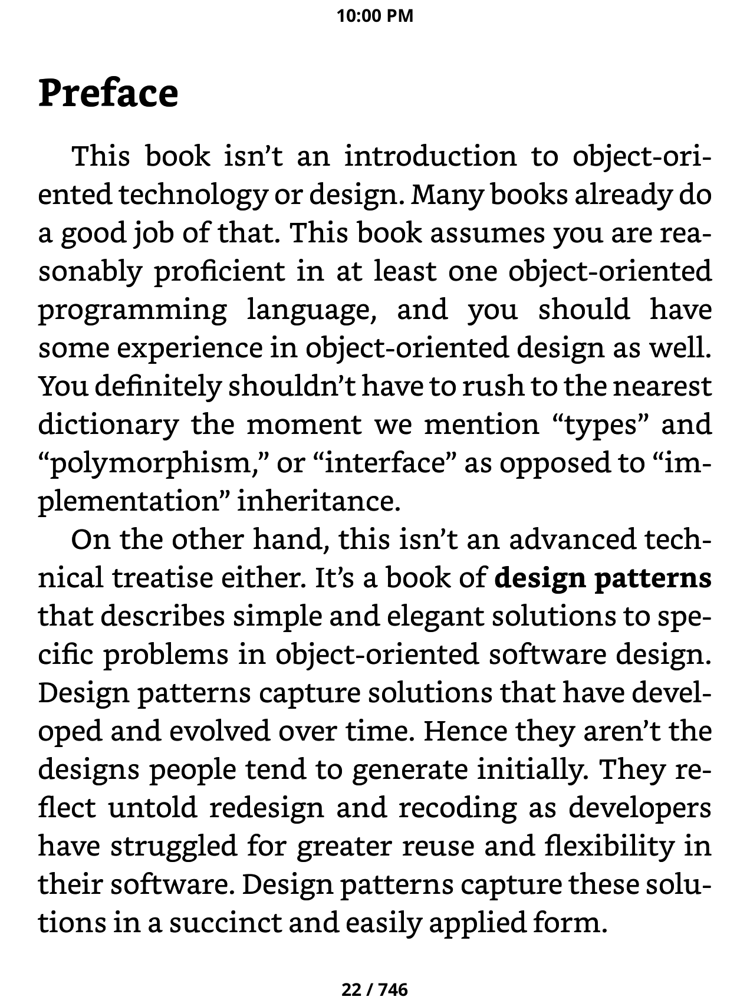
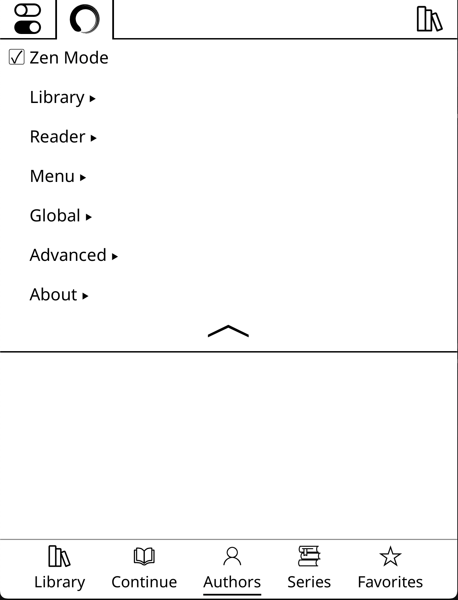

      

 
 

<h1 align="center">Zen UI</h1>

A clean and minimal UI for [KOReader](https://github.com/koreader/koreader). Zen UI removes visual clutter and replaces it with a streamlined, intuitive, and distraction-free e-reader experience.

## Philosophy

Zen UI is built on one idea: **less is more.** Every feature either removes noise or adds something genuinely useful. All settings are conveniently organized in one place. The minimal UI loads fast, stays out of the way, and aims to make your reading more enjoyable.  

Throughout development, three things were non-negotiable: **performance**, **stability**, and **battery life**. Patches are applied only when their feature is enabled. On e-ink devices where every refresh costs power and every frame counts, that matters.

## Speed & Performance

Zen UI is built to be lightweight and efficient. Tested with libraries containing thousands of books there are no dramatic changes in speed, responsiveness, or resource usage. Patches are strategically injected and only loaded when needed. Zen UI was designed from the ground up to make your e-reading experience fluid and enjoyable. Whether you're browsing a small personal library or managing a massive collection, Zen UI maintains consistent performance without taxing your device's battery or memory.

## Features

### Zen Mode

Strips down the default KOReader interfaces to their bare essentials.

### Bottom Navigation Bar
A clean, tab-based navigation bar at the bottom of the file browser. Configurable tabs (Library, Manga, Favorites, Authors, History, Collections, and more), with optional labels, custom icons, and sortable layout.

### Quick Settings Panel
A swipe-down panel accessible everywhere for the controls you actually use — brightness, warmth, WiFi, night mode, sleep, rotation, and more. Fully configurable: reorder, show/hide individual buttons.

### Custom Status Bars
A minimal status bar in the reader and a more extensive one in the Filebrowser. Shows only what you want: time, battery, progress, disk space, RAM — all optional and individually toggled.

### File Browser Improvements
- Cover images as folder thumbnails
- Clean mosaic and list view options with configurable density
- Hide the "up folder" entry for a cleaner look
- Remove underlines from file list items
- Configurable sort order, items per page, and landscape/portrait layout
- Zen pagination bar: A subtle, minimal page progress indicator — no numbers, no noise.
- A streamlined context menu in the file browser with quick access to read status, favorites, move, rename, and delete (optional).

### Reader Improvements
- An unobtrusive clock overlay inside the reader. Toggle 12/24-hour format independently of the system setting.
- Disable bottom menu, prevent unwanted changes to font size, margin etc

### Built-in Updater
Check for and install new Zen UI releases directly from the settings menu, without leaving KOReader.

## Unified Settings Tab 
- Pulled the most important settings from various locations into a single, more streamlined settings tab

## Installation

1. Go to the [Releases](https://github.com/AnthonyGress/zen_ui.koplugin/releases) page and download `zen_ui.koplugin.zip` from the latest release.
2. Unzip the archive. You should have a **folder** named `zen_ui.koplugin`.
3. Copy the `zen_ui.koplugin` **folder** into the KOReader plugins directory for your device:
> Make sure you are copying the unzipped **folder** and **not the .zip** file itself

| Device | Plugins directory |
|--------|-------------------|
| **Kobo** | `/mnt/onboard/.adds/koreader/plugins/` |
| **Kindle** | `/mnt/base-us/koreader/plugins/` |
| **PocketBook** | `/mnt/ext1/applications/koreader/plugins/` |
| **Android** | `sdcard/koreader/plugins/` |
| **Desktop (Linux/macOS)** | `/koreader/plugins/` |

4. Restart KOReader. Zen UI will load automatically.
5. Open **Zen UI Settings** from the file browser menu or the top menu to configure features.

> The final path should look like: `.../plugins/zen_ui.koplugin/main.lua`  

## Settings

Settings are grouped by feature area (File Browser, Navbar, Quick Settings, Status Bar, Reader). Most features can be toggled independently, some reasonable defaults have been selected. Changes that require a restart will prompt you automatically.

## Localization

Zen UI is currently translated into:

| Locale | Language |
|--------|----------|
| `en` | English |
| `it` | Italian |
| `es` | Spanish |
| `fr` | French |
| `nl` | Dutch |
| `pt_BR` | Brazilian Portuguese |
| `pt_PT` | European Portuguese |
| `ro` | Romanian |
| `ru` | Russian |
| `zh_CN` | Simplified Chinese |
| `zh_TW` | Traditional Chinese |

These translations may not be fully correct or complete. If you find any issues or corrections that you would like to see made, please feel free to contribute.

To contribute a translation or fix an existing one, see [locales/README.md](locales/README.md) and [CONTRIBUTING.md](CONTRIBUTING.md).

## Credits

Zen UI is original work, but it wouldn't exist without the broader KOReader community. Several open source projects provided components, inspiration, reference implementations, or code that was adapted and built upon:

- **[joshuacant/ProjectTitle](https://github.com/joshuacant/ProjectTitle)** — The OG plugin that started it all for me. This was my first experience with KOReader plugins and an alternative UI.
- **[qewer33/koreader-patches](https://github.com/qewer33/koreader-patches)** — The bottom navbar and quicksettings components. Additional patch approaches and ideas, particularly around UI customization.
- **[sebdelsol/KOReader.patches](https://github.com/sebdelsol/KOReader.patches)** — Patches and UI techniques that informed several of Zen UI's features.
- **[doctorhetfield-cmd/simpleui.koplugin](https://github.com/doctorhetfield-cmd/simpleui.koplugin)** — A fellow KOReader UI plugin that served as an inspiration as well as a model for how to apply language translations throughout the plugin.
- **[kristianpennacchia/zzz-readermenuredesign.koplugin](https://github.com/kristianpennacchia/zzz-readermenuredesign.koplugin)** — Inspiration for the reader search menu redesign

Thank you to everyone who published their KOReader work openly.

## Contributing

Bug reports, feature requests, translations, and code contributions are all welcome. See [CONTRIBUTING.md](CONTRIBUTING.md) for details.

Please follow these guidelines:

- **One feature per PR** - Keep pull requests focused on a single feature or fix
- **Review AI-generated code** - If using AI tools, all code must be thoroughly reviewed and tested before submitting
- **Maintain consistency** - New code must align with the project's existing style, theme, and overall user experience

## Security

See [SECURITY.md](SECURITY.md) for how to report vulnerabilities.

## License

[GPL-3.0](LICENSE)
